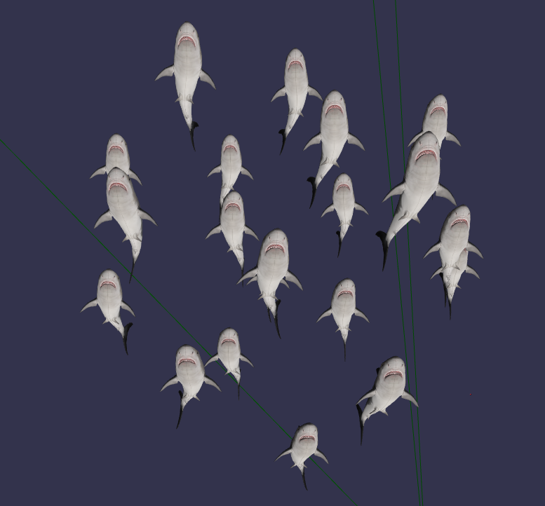
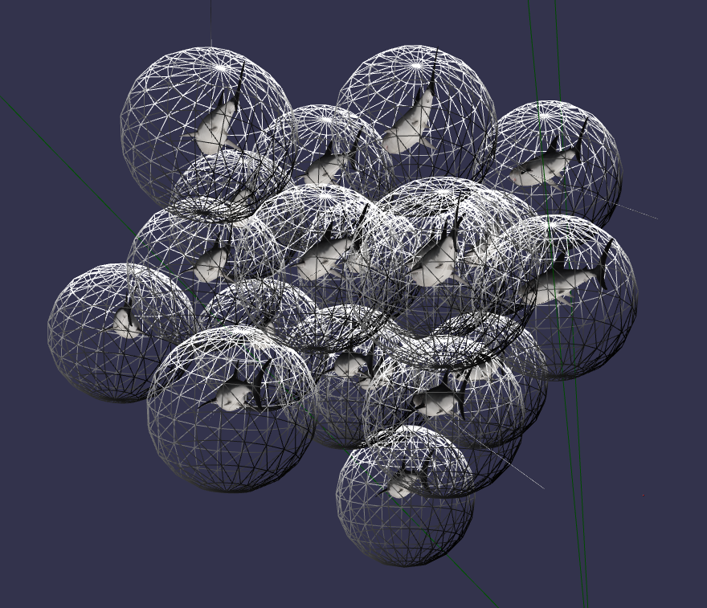

# babylon-boids
A [boids](https://en.wikipedia.org/wiki/Boids) library for [BabylonJS](https://babylonjs.com/). 

[Demo with boxes](https://corollarium.github.io/babylon-boids/boxes.html)
[Demo with scary sharks](https://corollarium.github.io/babylon-boids/fish.html)




## How to use it

First create your `BoidsManager` object and associate it with your meshes.

```js
function loadCubes (total, scene) {
    // instantiate our boids manager. Note it doesn't handle the meshes themselves, only the total meshes.
    const boidsManager = new BoidsManager(total, new BABYLON.Vector3(0.0, 0.0, 0.0), 10.0, 10.0);

    // so let's now create our meshes
    const models = [];
    const brickMaterial = new BABYLON.StandardMaterial('brickMaterial', scene);
    brickMaterial.diffuseTexture = new BABYLON.Texture('does_not_exist');
    for (let i = 0; i < total; i++) {
        // create a box
        const box = BABYLON.MeshBuilder.CreateBox(
            'box' + i,
            {
                width: 0.3, height: 0.5, depth: 1.0
            }
        );

        // associate box to boid data. 
        box.boid = boidsManager.boids[i];
        box.material = brickMaterial;
        models.push(box);
    }

    // if you want to get a debug with bounding spheres and velocity vectors
    boidsManager.showDebug();
    boidsManager.gui(scene);

    // so we return 3 things here: the models, the boidsManager, and an update callback
    // for the render loop.
    return {
        models,
        boidsManager,
        update: ((_boids, _models) => {
            return (deltaTime) => {
                // update the boid simulation first
                _boids.update(deltaTime);
                // now apply the calculated positions/orientations to the meshes
                _models.forEach((m) => {
                    m.position.copyFrom(m.boid.position);
                    m.setDirection(m.boid.orientation);
                });
            };
        })(boidsManager, models)
    };
}
```

Remember to call the update function

```js
    // create a boid block with 20 boids
    const myBoids = loadCubes(20, scene);

    // Register a render loop to repeatedly render the scene
    engine.runRenderLoop(() => {
        const timeDiff = engine.getDeltaTime() / 1000.0;

        // update boids
        myBoids.update(timeDiff);

        scene.render();
    });
```

## API

### `constructor(total, center, initialRadius = 1.0, boundRadiusScale = 100.0, initialVelocity = null)`
Constructor. See [parameters](#Parameters) for class parameters that can be accessed and changed directly.
`int total`: Total number of boids in simulation
`BABYLON.vector3 center`: The center point of the boid volume.
`float initialRadius`: The radius of the initial boid volume. Boids are distributed randomly within this volume from `center` when created.
`float boundRadiusScale`: The bounding volume for the total simulation. Boids are restricted to this volume from `center`.
`BABYLON.vector3 initialVelocity`: The inicial velocity for the boids. A small randomness factor is added to each boid.

### `update(deltaTime)`
Updates the boids. Call on every render loop.
`Number deltaTime` The time since last frame in seconds.

### `addForce(c)`
Adds a force callback function. This enables you to change the simulation with your own forces. Called fr
`callback c` A valid JS function, called on `update()` for each boid. Receives as parameters: `(BoidsManager, Boid)`

### `showDebug(scene)`
Turns on debug visual helpers.
`BABYLON.scene scene` The scene object.

### `hideDebug(scene)`
Turns off debug visual helpers.
`BABYLON.scene scene` The scene object.

### `gui(scene)`
Turns on a panel to visually change the boid simulation parameters. 
`BABYLON.scene scene` The scene object.

## Parameters

All accessed on the BoidsManager instance.

`cohesion` Cohesion factor.
`separation` Separation factor.
`alignment` Alignment factor.
`separationMinDistance` The
`maxSpeed` The maximum allowed speed for a boid, in units per second.
`boundsMin` The minimum bounds for the valid boid volume.
`boundsMax` The maximum bounds for the valid boid volume.

## LICENSE

[MIT](LICENSE)
